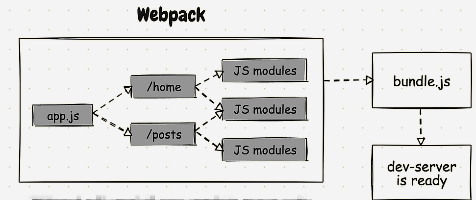
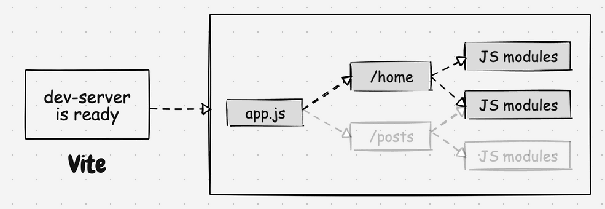

# bundle-based vs module bundler

bundle-based

module bundler


# Vite 热更新原理

在现代前端开发中，热更新（Hot Module Replacement，简称 HMR）是提高开发效率的关键技术。Vite 作为一个快速的构建工具和开发服务器，以其极速的热更新能力广受欢迎。本篇博客将详细介绍 Vite 的热更新原理，并通过丰富的代码示例，从简单到复杂，逐步剖析其工作机制。

## 什么是热更新？

热更新是一种在不刷新整个页面的情况下，实时更新已加载模块的技术。这不仅可以加快开发速度，还可以保留应用程序的状态，使得开发过程更加流畅。

## Vite 的热更新工作原理

Vite 的热更新主要依赖于两个核心部分：**开发服务器**和**模块热替换**。我们先来了解一下这两个部分的基本原理。

### 开发服务器

Vite 内置了一个开发服务器，当你启动 Vite 项目时，开发服务器会监听你的源文件变化（通过 chokidar 实现），并在检测到变化时触发客户端相应的更新。

### 模块热替换

模块热替换（HMR）是 Vite 热更新的核心，它允许在应用运行时替换、添加或删除模块，而无需完全刷新页面。

## 简单示例

我们从一个简单的示例开始，逐步理解 Vite 的热更新原理。

### 设置项目

首先，我们需要一个 Vite 项目。使用以下命令创建一个新的 Vite 项目：

```sh
npm init vite @vitejs/plugin-vue  my-vite-app
cd my-vite-app
npm install
npm run dev
```

### 热更新示例

增加配置文件 文件 `vite.config.js`：

```js
// counter.js
import { defineConfig } from "vite";
import vue from "@vitejs/plugin-vue";

// https://vitejs.dev/config/
export default defineConfig({
  plugins: [vue()],
});
```

运行 `npm run dev` 启动开发服务器后，当你修改 `App.vue` 文件时，Vite 会自动触发热更新，无需手动刷新页面。

## 深入理解热更新机制

让我们深入探讨 Vite 是如何实现热更新的。

## 建一个 Demo

运行 `pnpm create vite how-work --template vanilla` 启动开发服务器后，当你修改 `App.vue` 文件时，Vite 会自动触发热更新，无需手动刷新页面。

改写 `main.js` 文件：

```js
function render() {
  document.querySelector("#app").innerHTML = `
    <div>
      <h1>Hello Vite44!</h1>
    </div>
  `;
}

render();
```

启动服务后，修改 `main.js` 文件，Vite 会自动触发热更新,只不过会刷新整个页面。

怎么实现局部刷新呢？在 `main.js` 文件添加如下代码：

```js
if (import.meta.hot) {
  import.meta.hot.accept((newModule) => {
    newModule?.render();
  });
}
```

再次更改 `main.js` 文件，Vite 会自动触发热更新,只会刷新局部。那么是怎么实现的呢？

## 热更新实现原理简介

从整体角度来看，vite 热更新主要分为三步：

1.创建模块依赖图：建立模块间的依赖关系（packages\vite\src\node\server\index.ts）

```js
const moduleGraph: ModuleGraph = new ModuleGraph((url, ssr) =>
  container.resolveId(url, undefined, { ssr })
);
```

建立了如下管理
ModuleGraph -> ModuleNode -> acceptedHmrDeps 需要热更新的模块

2.服务端收集更新模块：监听文件变化，确定需要更新的模块 （packages\vite\src\node\server\index.ts）
通过 chokidar 监听文件变化，并触发更新

```js
const watcher = chokidar.watch(
[root, ...config.configFileDependencies, config.envDir],
resolvedWatchOptions,
) as FSWatcher

```

当文件变化时，会执行以下代码：

```js
watcher.on("change", async (file) => {
  file = normalizePath(file);
  await container.watchChange(file, { event: "update" });
  // invalidate module graph cache on file change
  moduleGraph.onFileChange(file); // 重新建立依赖图
  await onHMRUpdate("update", file); // 触发实际的更新操作
});
```

核心方法 `onHMRUpdate` 会触发相关的更新操作,即执行了 `handleHMRUpdate`,其中的三个核心步骤是：
有三个执行步骤(\packages\vite\src\node\server\hmr.ts)：

    1.配置文件（vite.config.js）、环境变量更新(.env),直接重启服务

    2.客户端注入的文件(vite/dist/client/client.mjs)、html 文件更新，直接reload整个页面

    3.普通文件更新，通过 updateModules 执行热更新操作

3.客户端派发更新：客户端执行文件更新

在项目启动阶段，会向创建的 index.html 注入一段 script 脚本 <script type="module" src="/@vite/client"></script>，`setupWebSocket`去建立与服务端的连接，并通过`handleMessage`监听服务端发送的更新通知,并执行具体的更新操作。

### WebSocket 连接

当你启动 Vite 的开发服务器时，它会为客户端（浏览器）建立一个 WebSocket 连接，用于实时通信。当服务器检测到文件变化时，它会通过 WebSocket 向客户端发送更新通知。

### 模块更新

客户端接收到更新通知后，会检查受影响的模块并触发相应的更新逻辑。在 `main.js` 示例中，`import.meta.hot.accept()` 注册了模块的更新回调，当模块更新时，回调函数`render`就会被调用。

## Vite 的高级热更新功能

除了基本的模块热替换，Vite 还支持更高级的热更新功能，例如状态保留、CSS 热替换等。

### 状态保留

在某些情况下，你可能希望在热更新时保留组件的状态。Vite 提供了相关的 API 来实现这一点。

### CSS 热替换

Vite 支持 CSS 热替换，当你修改 CSS 文件时，Vite 会自动更新样式而无需刷新页面。例如：

```css
/* styles.css */
body {
  background-color: lightblue;
}
```

```js
import "./styles.css";
```

当你修改 `styles.css` 文件时，Vite 会自动更新样式。

## 总结

Vite 的热更新功能极大地提高了开发效率，使得开发者可以快速地看到代码修改的效果。本文从简单到复杂，逐步解析了 Vite 的热更新原理及其在实际项目中的应用。希望这篇博客能帮助你更好地理解和利用 Vite 的热更新功能。
